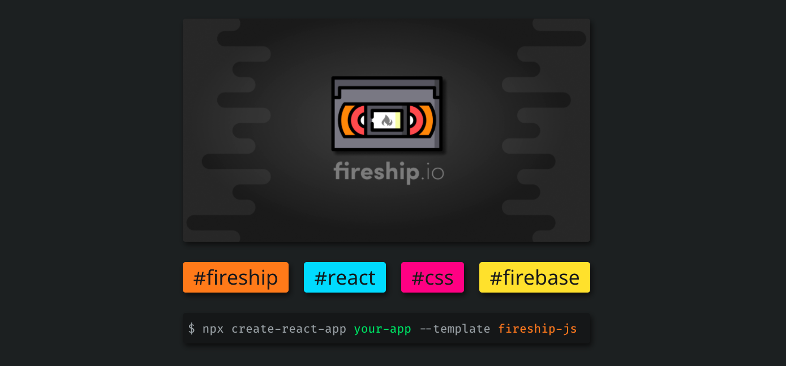

# Fireship CRA

[](https://firebase.com)

[](https://reactjs.com)

[](https://img.shields.io/github/issues/klutchdev/fireship-js)

## Usage

### npx

```sh
npx create-react-app <your-app-name> --template fireship-js
```

### commands

```sh
# Start the dev server
npm start

# Build for production
npm run build

# Analyze production build bundle size 
npm run analyze
```


